# 💼 Sistema de Préstamos y Cobranzas

Este sistema permite gestionar socios, préstamos, pagos, retiros, reportes y configuraciones institucionales mediante una interfaz moderna, clara y adaptable. Incluye generación automática de recibos, reportes y backups.

## 🚀 Funcionalidades Principales

### 🏠 Interfaz Inicial

-   Vista general de módulos y accesos directos personalizados.

### ⚙️ Configuraciones

-   Personaliza datos institucionales: nombre, contacto, moneda, valores financieros.

### 👥 Gestión de Socios

-   Registro, visualización, historial y administración de socios.

### 💸 Préstamos

-   Registro, seguimiento, detalles y reportes automáticos de préstamos.

### 💳 Pagos

-   Registro de pagos, generación de recibos y cálculo automático de intereses.

### 🏧 Retiros

-   Control de retiros con emisión de recibos.

### 📊 Reportes

-   Generación de reportes globales, mensuales, anuales y personalizables.

### 💾 Backups

-   Respaldo automático de la base de datos.

## ⚙️ Requisitos del Sistema

-   `Git`
-   `XAMPP`
-   `PHP >= 8.1`
-   `Composer`
-   Extensión de PHP GD habilitada (en el archivo `php.ini`, C:\xampp\php\php.ini):
    Ve a la ruta C:\xampp\php\php.ini o la que instalaste Xampp

    ```
    ;extension=gd
    ↓
    extension=gd
    ```

## 🧪 Instalación Local

1. **Clona el repositorio**

    ```bash
    git clone https://github.com/Nolos17/PrestamosYCobranzas.git
    cd PrestamosYCobranzas
    ```

2. **Instala dependencias PHP**

    ```bash
    composer install
    # o
    composer update
    ```

3. **Configura el archivo `.env`**

    - Copia `.env.example` a `.env`
    - Ajusta las credenciales de la base de datos:
        ```env
        DB_DATABASE=prestamos
        DB_USERNAME=root
        DB_PASSWORD=
        ```

4. **Importa la base de datos**


    - Usa phpMyAdmin o el cliente MySQL.
    - Archivo `.sql` incluido (/backup/prestamosDB).
    - Tambien puedes utilizar la migracion y los seeders configurados por defecto.

    ```bash
    php artisan migrate:fresh --seed
    ```

5. **Crea el enlace simbólico de almacenamiento**

    ```bash
    php artisan storage:link
    ```

6. **Verifica variables de entorno del sistema (Windows)**
    - Asegúrate de que PHP y Composer estén agregados al `PATH`.

## 📸 Vista de Funcionalidades

-   Login
    
-   Interfaz inicial
    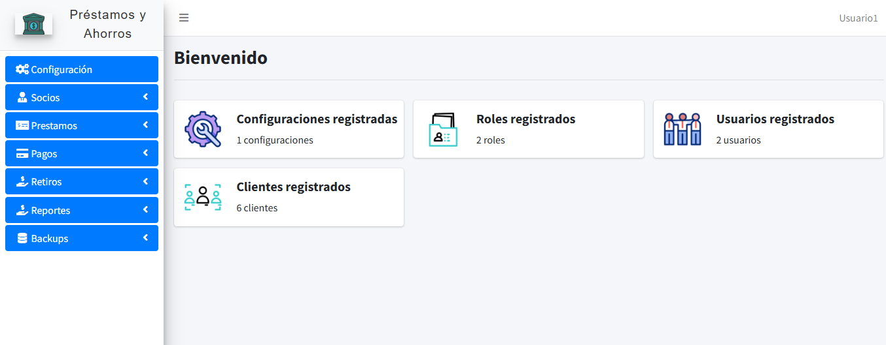
-   Configuración
    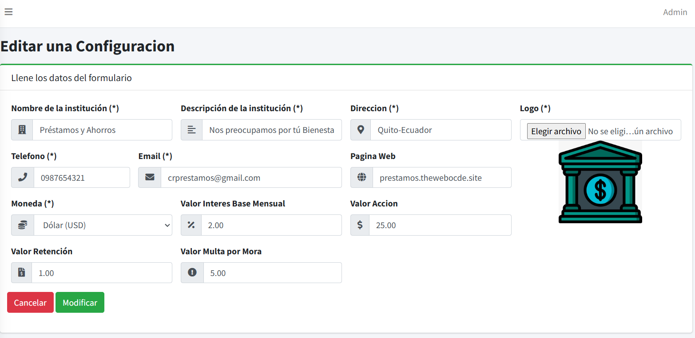
-   Registro y gestión de socios
    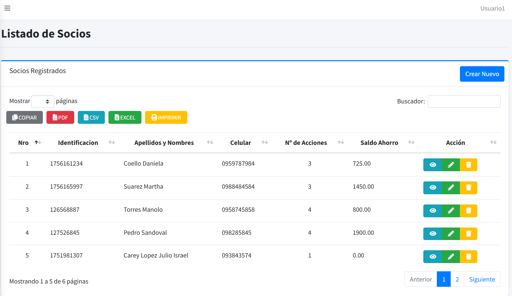
    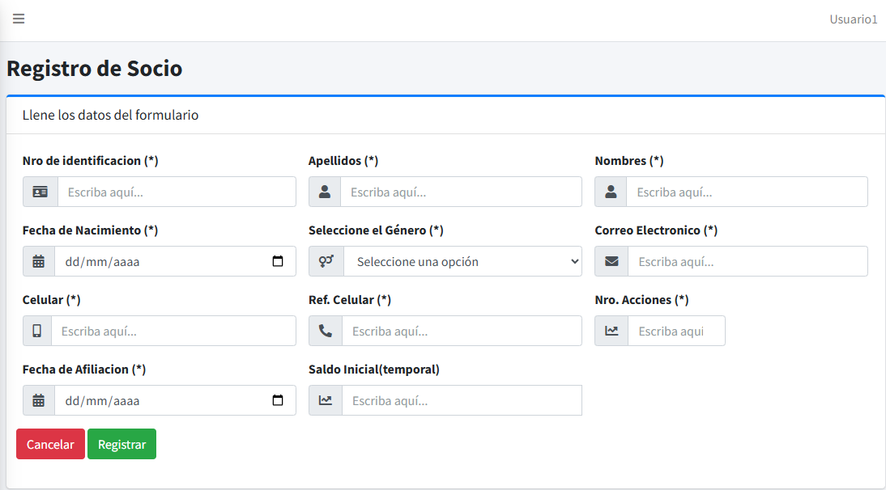
-   Préstamos
    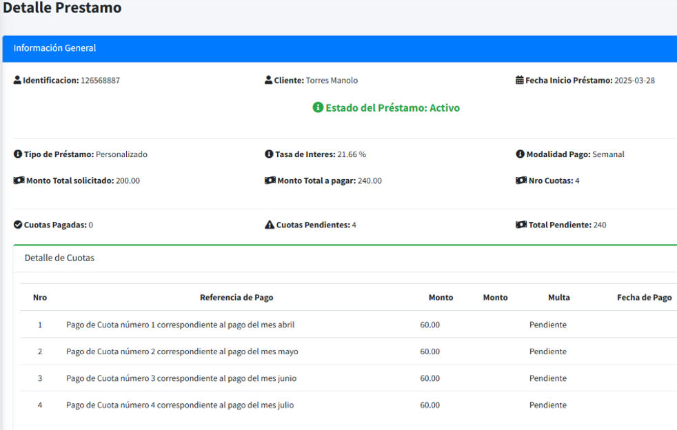
    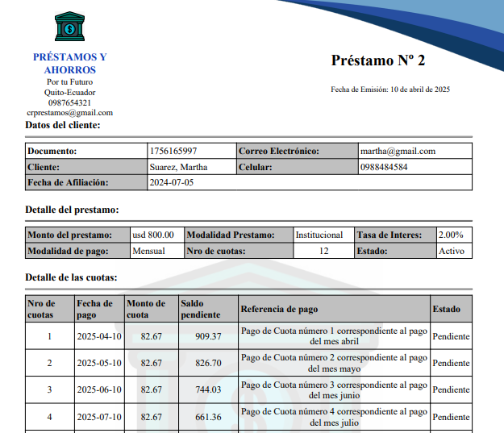
-   Pagos e intereses
    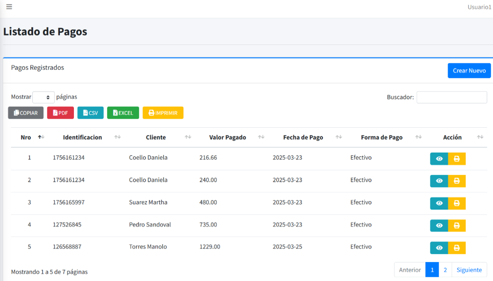
    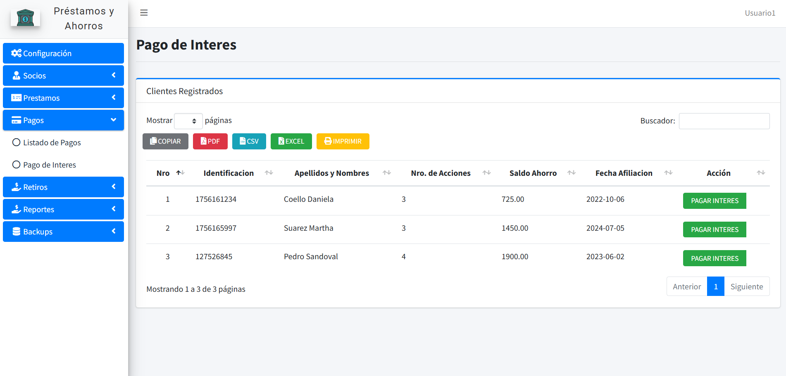
    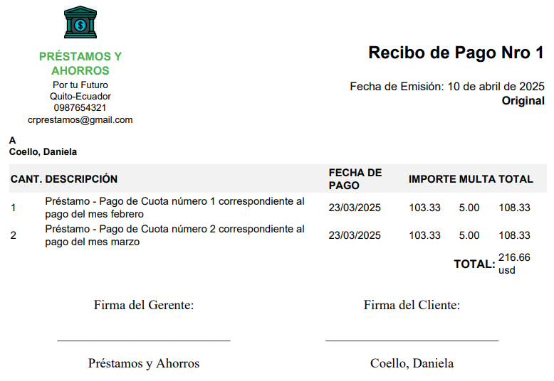
-   Reportes
    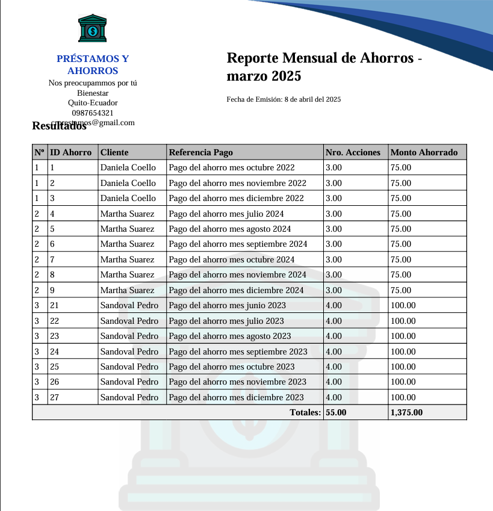
    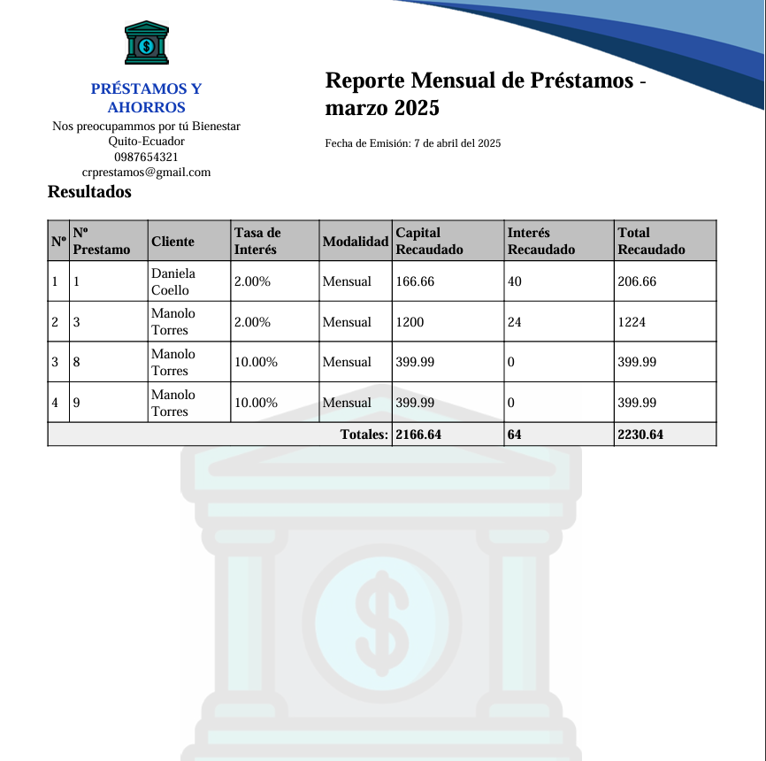
    

-   Backups
    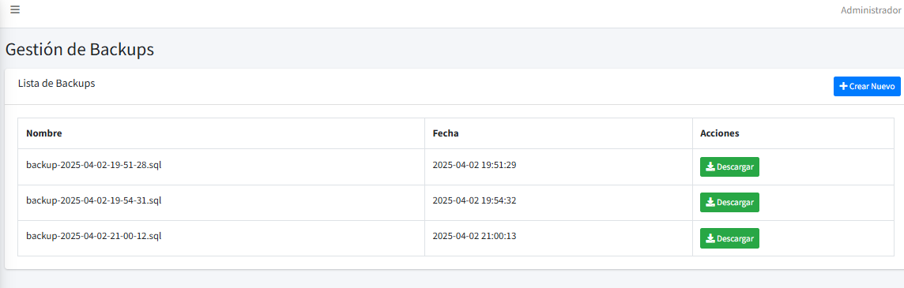

¡Todo desde una UI limpia, responsiva y moderna!

## 🤝 Contribuciones

¿Ideas, mejoras o errores? ¡Eres bienvenido a contribuir!

## 🛡️ Licencia

Este proyecto se distribuye bajo la licencia [MIT](LICENSE).
